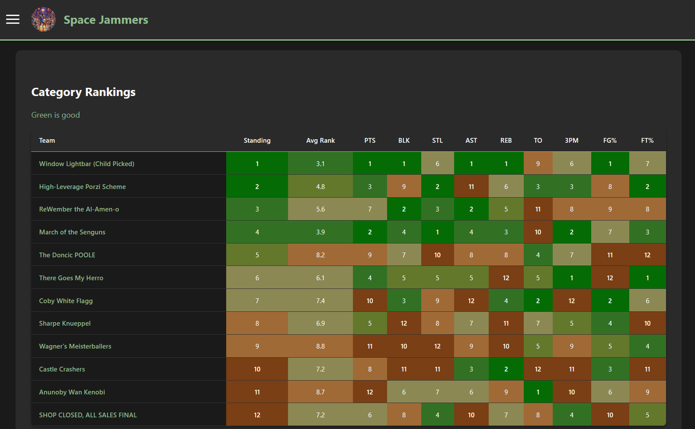
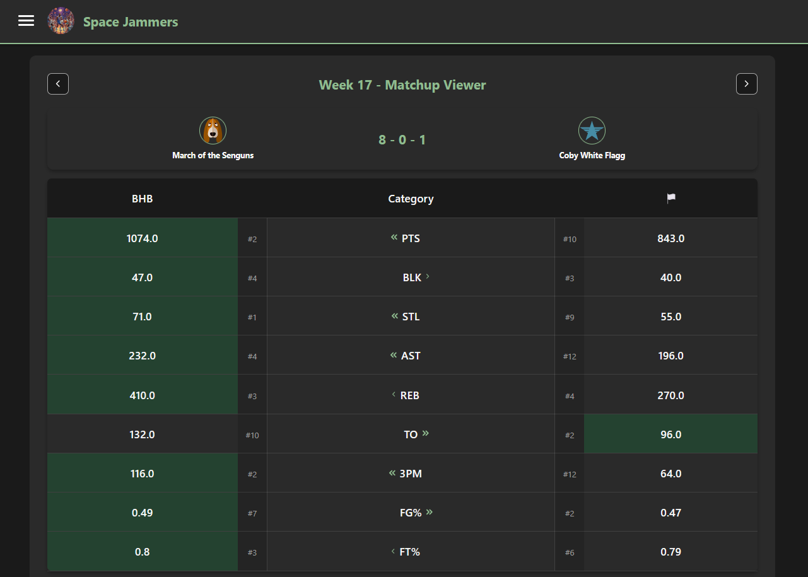

# LeagueLens Basketball

Web dashboard for ESPN fantasy basketball leagues. Pulls data from ESPN's Fantasy API and displays team statistics, player performance, matchups, and trade analysis.

See it live at [space-jammers.com](https://space-jammers.com) (my own league — if we're not in NBA season, some things won't make sense).

## Screenshots

| Homepage | Matchup Viewer |
|---|---|
|  |  |

## Quick Start

### Docker Compose (recommended)

Grab the template, set your league ID, and run:

```bash
curl -O https://raw.githubusercontent.com/NathanEmb/league-lens-basketball/main/compose/compose.yaml
# edit LEAGUE_ID in compose.yaml, then:
docker compose up -d
```

Open `http://localhost:8000`.

### Local development

```bash
cp .env.example .env          # set your LEAGUE_ID
uv sync
uv run uvicorn src.app:app --reload --port 8000
```

## Features

- **Category Rankings**: Visualize team performance across 9 statistical categories
- **Team Viewer**: Detailed breakdown of individual team strengths, weaknesses, and trends
- **Matchup Viewer**: Compare head-to-head matchups with detailed statistics
- **Trade Analyzer**: Evaluate potential trades with projected stat impact analysis
- **Mobile-Friendly**: Optimized for mobile devices with responsive design and touch-friendly controls

## Configuration

| Variable | Required | Default | Description |
|---|---|---|---|
| `LEAGUE_ID` | Yes | `233677` | Your ESPN fantasy basketball league ID |
| `APP_NAME` | No | `LeagueLens Basketball` | Dashboard name shown in the header and page titles |
| `LOGO_URL` | No | Basketball SVG | URL for a custom logo image in the nav bar |
| `FAVICON_URL` | No | Basketball SVG | URL for a custom favicon |
| `YEAR` | No | Current year | Season year for data fetching |

## Technical Details

- **Backend**: [FastAPI](https://fastapi.tiangolo.com/) with server-rendered Jinja2 templates
- **Data**: [ESPN API](https://github.com/cwendt94/espn-api) + [Pandas](https://pandas.pydata.org/) for transformations
- **Frontend**: Vanilla CSS (mobile-first dark theme) + Feather Icons, no JS framework
- **Deployment**: Standard Docker container — works on any platform (Fly.io, Railway, AWS ECS, etc.)

## Contributing

1. Follow the existing code structure and style
2. Use appropriate docstrings for new functions
3. Test your changes locally before submitting PRs
4. Ensure mobile responsiveness for any UI changes

## AI Disclosure

As is true with many (all?) software development projects these days, LLM based tools were used in the development of this project. Primarily in supporting the frontend development, writing CSS/HTML/JS where necessary. As a summary:

| Section | AI Use Description |
|---|---|
| Backend | AI Assisted, primarily hand coded, fully reviewed |
| Frontend | AI writtenn, lightly reviewed |
| Deployment Instructions and Docs| Handwritten docs, AI assisted planning | 